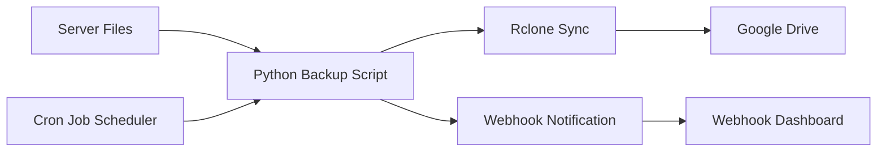
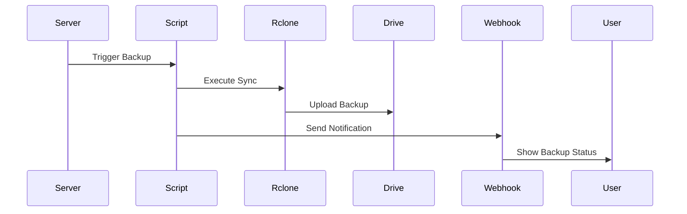
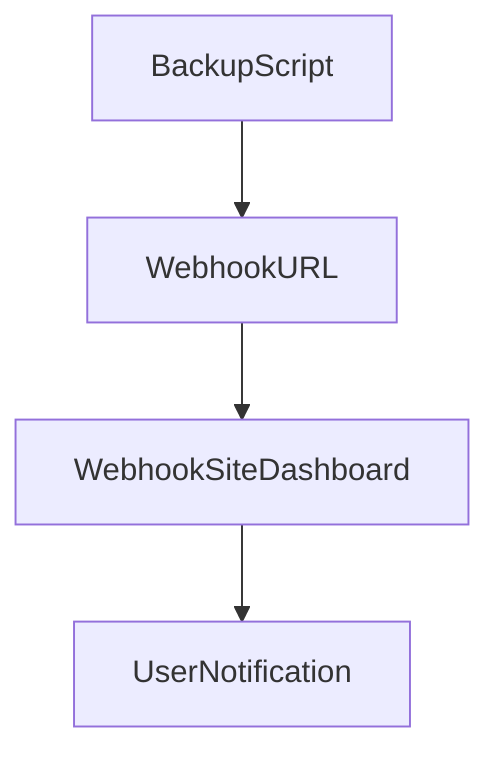

# 🚀 Automated Backup System with Google Drive & Webhook Notifications


---

# 📌 Project Overview

The **Automated Backup System** is a cloud automation project that performs automatic backups from an **AWS EC2 Ubuntu server** to **Google Drive** using **Rclone**.

The system is designed to:

• Automate backup tasks  
• Store backups securely in cloud storage  
• Send real-time notifications using Webhooks  
• Run automatically using Cron Jobs  

This project demonstrates **DevOps automation, cloud integration, and infrastructure reliability practices.**

---

# 🎯 Project Objectives

- Automate server file backups
- Store backups in Google Drive
- Implement real-time monitoring
- Reduce manual intervention
- Implement DevOps automation
- Improve system reliability

---

# 🧰 Technologies Used

| Technology | Purpose |
|-----------|--------|
| AWS EC2 | Cloud server |
| Ubuntu Linux | Operating system |
| Python | Automation script |
| Rclone | Cloud storage sync |
| Google Drive | Backup storage |
| Webhook.site | Notification monitoring |
| Cron Jobs | Scheduling automation |
| GitHub | Version control |

---

# 🏗️ System Architecture



---

# ☁️ Architecture Workflow



---

# 📂 Project Folder Structure

```
BackupProject
│
├── Projects
└── Myproject
├── backup.py
├── config.json
├── backup.log
└── backups

```

---

# ⚙️ Prerequisites

Before starting the project install the following:

- AWS Account
- Ubuntu EC2 Instance
- Python3
- Rclone
- Google Drive account
- Webhook.site URL

---

# 🚀 Project Setup Steps

---

## 1️⃣ Launch EC2 Instance

Login to AWS Console

Create **Ubuntu EC2 Instance**

Connect using SSH

```
ssh ubuntu@your-ec2-public-ip
```

---

## 2️⃣ Update System

```
sudo apt update
sudo apt upgrade -y
```

---

## 3️⃣ Install Python

```
sudo apt install python3 -y
```

Verify installation

```
python3 --version
```

---

## 4️⃣ Install Rclone

```
curl https://rclone.org/install.sh | sudo bash
```

Verify installation

```
rclone version
```

---

## 5️⃣ Configure Google Drive

Run

```
rclone config
```

Choose

```
n → new remote
name → gdrive
storage → drive
```

Complete authentication.

Test connection

```
rclone ls gdrive:
```

---

# 📄 Project Configuration Files

---

# config.json

```json
{
  "project_name": "MyProject",
  "source_directory": "/home/ubuntu/BackupProject/Projects",
  "backup_directory": "/home/ubuntu/backups",
  "gdrive_remote": "gdrive",
  "gdrive_folder": "BackupFolderName",

  "retention_daily": 7,
  "retention_weekly": 4,
  "retention_monthly": 3,

  "webhook_url": "https://webhook.site/284d5480-874e-4566-ab28-037b97515273"
}
```

---

# backup.py

```python
import os
import json
import subprocess
import requests
from datetime import datetime

# Load configuration
with open("config.json") as config_file:
    config = json.load(config_file)

source_folder = config["source_folder"]
drive_remote = config["drive_remote"]
webhook_url = config["webhook_url"]

# Generate backup folder name
backup_name = "backup_" + datetime.now().strftime("%Y%m%d_%H%M%S")

# Rclone command
command = f"rclone copy {source_folder} {drive_remote}/{backup_name}"

# Execute command
result = subprocess.run(command, shell=True)

# Prepare notification
if result.returncode == 0:
    status_message = {"status": "Backup Successful"}
else:
    status_message = {"status": "Backup Failed"}

# Send webhook notification
requests.post(webhook_url, json=status_message)
```

---

# ⏰ Cron Job Automation

Open crontab

```
crontab -e
```

Add the following job

```
0 2 * * * * python3 /home/ubuntu/BackupProject/backup.py
```

This will run the backup **every hour automatically**.

---

# 🔔 Webhook Notification Flow



---

# 🖼️ Expected Screenshots

Add these screenshots to your documentation.

1. EC2 Instance Running
2. SSH Connection to Server
3. Rclone Installation
4. Google Drive Configuration
5. Project Folder Structure
6. Running Backup Script
7. Files Uploaded to Google Drive
8. Webhook Notification Received
9. Cron Job Configuration

---

# ⚠️ Issues Faced and Solutions

---

## Issue 1: Python Command Not Found

Error

```
python: command not found
```

Solution

Use

```
python3 backup.py
```

---

## Issue 2: Rclone Command Not Found

Error

```
rclone: command not found
```

Solution

Reinstall Rclone

```
curl https://rclone.org/install.sh | sudo bash
```

---

## Issue 3: Google Drive Not Syncing

Solution

Reconfigure Rclone

```
rclone config
```

---

# 📊 Project Benefits

✔ Fully automated backup system  
✔ Secure cloud storage integration  
✔ Real-time monitoring  
✔ DevOps automation implementation  
✔ Disaster recovery ready  

---

# 🔐 Security Best Practices

- Do not upload `config.json` publicly
- Restrict Google Drive access
- Protect webhook URL
- Use proper IAM policies

---

# 🔮 Future Improvements

- Add AWS S3 backup
- Integrate Slack notifications
- Add logging dashboard
- Implement Docker container
- Add monitoring using Prometheus

---

# 👨‍💻 Author

**Prasad Bhoite**  
Cloud & DevOps Enthusiast

## 📩 Connect With Me :-

If you’d like to collaborate, discuss projects, or just say hello — feel free to reach out!  

### 🔗 Social & Professional Links
- 🌐 [Portfolio Website](https://prasad-bhoite19.github.io/prasad-portfolio/)  
- 💼 [LinkedIn](http://linkedin.com/in/prasad-bhoite-a38a64223)  
- 🐙 [GitHub](https://github.com/Prasad-bhoite19)  
- ✉️ [Email](prasadsb2002@gmail.com)  

---

# ⭐ Support

If you like this project

⭐ Star the repository  
🍴 Fork the repository  
📢 Share with others  

---

# 📜 License

This project is created for **educational and learning purposes**.

---
